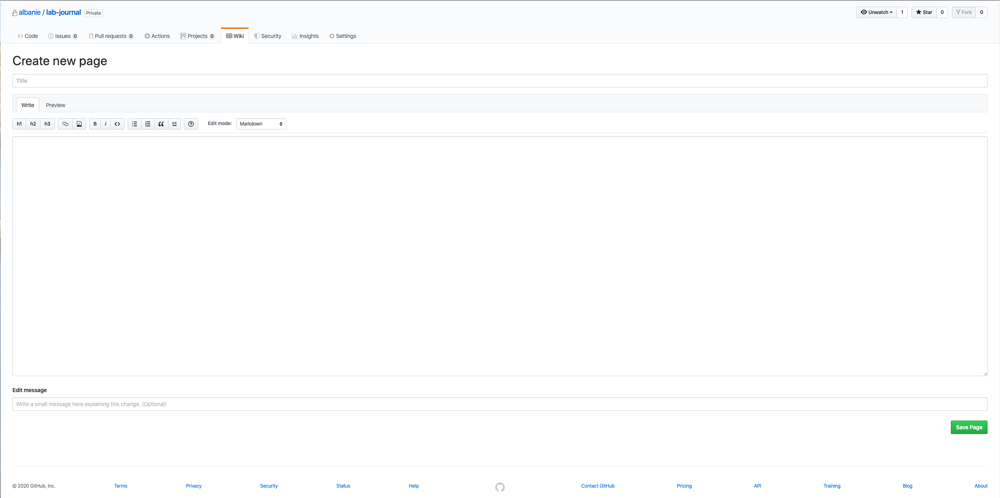
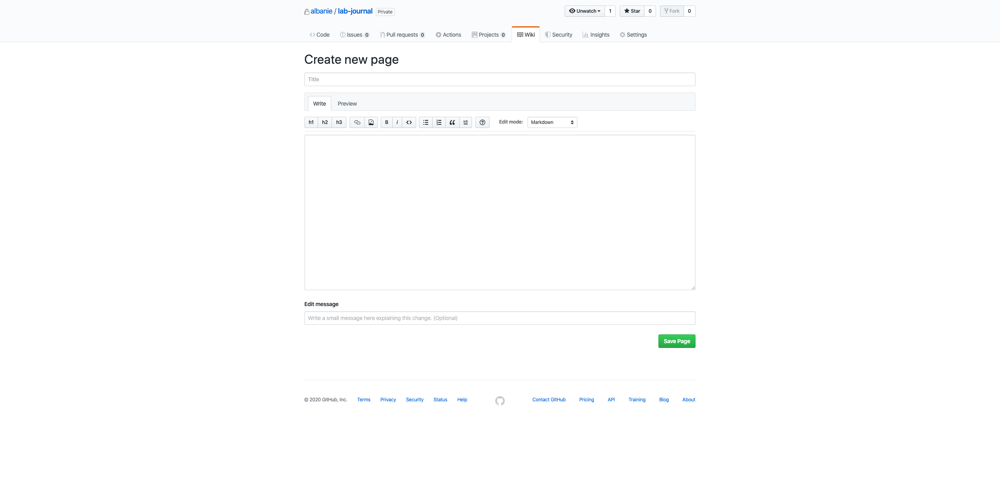

## Tall-and-Wide Github Wiki Editor

This repo provides a stylesheet that aims to improve wiki editing on GitHub when using a large monitor.


### Behaviour

The behvaiour of **Tall-and-Wide** on the wiki editing experience is illustrated in the screenshots below:

**Tall-and-Wide**


**GitHub** (the default GitHub wiki editor - not tall, not wide)



### Installation

1. Follow the instructions here for the GitHub Wide theme:
https://github.com/mdo/github-wide

2. Update the stylesheet by pasting in [stylish-sheet.css](stylish-sheet.css) into your style sheet manager (note, this has only been tested with [stylish](https://chrome.google.com/webstore/detail/stylish-custom-themes-for/fjnbnpbmkenffdnngjfgmeleoegfcffe?hl=en)).

2. Apply a regexp to ensure that the theme only affects the wiki editor e.g.

`https:\/\/github[.]com\/albanie.*\/wiki\/.*_edit`

(where you should change `albanie` to your username).


### Implementation Details


If you'd like to customise it further, the taller wiki editing box is achieved by inserting the following into the CSS:

```
/* have a large editor panel */
.previewable-comment-form textarea {
    max-height: 600px;
}
.gollum-editor .gollum-editor-body {
    height: 600px;
}
```

### Acknowledgements

The repo is just a slight modification to the GitHub Wide theme [here](https://github.com/mdo/github-wide). Credit to [Mark Otto](https://github.com/mdo) for creating the original.